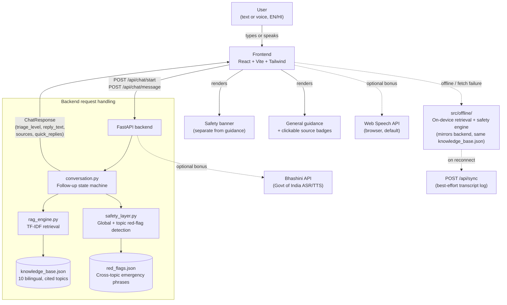

# Architecture

## System overview

## Why the safety layer is a *separate* module from retrieval

This is the single most important architectural decision in the project,
and it's the direct answer to the brief's "safety-first questioning" and
"avoid unsupported medical diagnoses" goals.

- `rag_engine.py` only ever answers "which knowledge-base topic is this
  closest to, and what are its citations?" It has no concept of urgency.
- `safety_layer.py` only ever answers "does anything in this message or
  in the collected follow-up answers look dangerous?" It has no concept
  of topics or citations.
- `conversation.py` combines both, but the combination rule is simple and
  auditable: **the safety layer's verdict can only ever escalate the
  triage level, never be silently downgraded by a "nice" retrieved
  answer.** See `escalate_from_followups()` — an EMERGENCY verdict short-
  circuits everything else in the same turn.

This separation means a judge (or a future contributor) can read
`safety_layer.py` in isolation and verify the safety behavior without
having to reason about the retrieval/ranking code at all, and vice versa.

## Why TF-IDF instead of embeddings for the MVP

- Zero external API calls -> the demo works with no internet and no API
  keys, which matters a lot when your hackathon wifi is unreliable.
- The knowledge base is small (10 curated topics) and keyword-rich
  (English + Hindi keywords per entry), so TF-IDF + a keyword-boost
  already performs very well — see `backend/tests/test_safety_layer.py`
  for the retrieval accuracy tests.
- The retrieval interface is a single function, `retrieve(query) -> List[RetrievalHit]`,
  isolated in `rag_engine.py`. Swapping in a real vector store does not
  touch the safety layer, the conversation flow, or the API contract.

### Upgrade path: embeddings + a vector store

If you have time left in the hackathon (or want to extend this after):

1. Replace `TfidfVectorizer` with `sentence-transformers`
   (`paraphrase-multilingual-MiniLM-L12-v2` handles Hindi + English in one
   model) to embed each `knowledge_base.json` entry.
2. Store vectors in `chromadb` (pure-Python, no server needed) or `faiss-cpu`.
3. Keep the exact same `retrieve(query) -> List[RetrievalHit]` signature so
   nothing else in the codebase needs to change.
4. Optionally chunk longer source documents (e.g. full WHO fact sheets)
   instead of one paragraph per topic, for finer-grained citations.

### Upgrade path: LLM-phrased answers

Right now, answers are built by concatenating fields straight from
`knowledge_base.json` — this is deliberate, because it makes every word in
the final answer traceable to a specific JSON field and its citation.

If you want more natural phrasing on top of that:
- Feed the **retrieved, cited content only** (never open knowledge) to an
  LLM with a system prompt like: *"Rephrase the following verified content
  for a worried, possibly non-expert reader. Do not add any medical claim
  that is not present in the input. Do not remove the citations."*
- Keep the safety banner rendering **outside** the LLM call entirely —
  the triage verdict and emergency numbers should never depend on model
  output at all.
- `config.py` already has `ANTHROPIC_API_KEY` / `LLM_ENABLED` wired up as
  a no-op placeholder for exactly this.

## Data flow for one conversation turn

1. Frontend sends `{session_id, message, language}` to `POST /api/chat/message`.
2. `safety_layer.check_global_emergency()` scans the raw text first, on
   every turn, regardless of conversation stage.
3. If no global emergency: `conversation.handle_message()` looks at the
   session's current `Stage` (symptom -> duration -> severity -> age ->
   red-flag checklist -> done) and either asks the next follow-up
   question or, on the last stage, calls `_format_final_answer()`.
4. `_format_final_answer()` pulls the matched topic from `rag_engine`,
   recomputes the triage level from severity/duration/age/red-flags via
   `safety_layer.escalate_from_followups()`, and assembles the response —
   general guidance and the safety banner as clearly separate sections.
5. Response is returned with a strongly-typed `sources: List[Source]`
   field (see `schemas.py`) — the API contract makes it structurally
   impossible to return an answer with no citation object, even if it's
   empty for a pure-emergency response.

## Session storage

Sessions live in an in-memory Python dict (`conversation.SESSIONS`) for
the hackathon MVP — simplest possible thing that works for a live demo.
For a real deployment with more than one backend process/replica, swap
this for Redis (a `SESSION_TTL` and `redis.hset`/`hgetall` drop-in is a
good "if we had one more day" talking point) — see `DEPLOYMENT_GUIDE.md`.

## Home remedies: a second, independently-gated citation track

`knowledge_base.json` carries two separate source lists per topic:
`sources` (WHO/NHS/MoHFW, backing clinical self-care) and `remedy_sources`
(Ministry of AYUSH, backing traditional home remedies). This split exists
so the two kinds of guidance are never blended into one undifferentiated
claim — the frontend renders them as visually distinct badge groups.

The safety-critical part: `conversation.py`'s `_format_final_answer()`
only ever includes `home_remedies` / `remedy_sources` in the response when
`final_level` is `SELF_CARE` or `ROUTINE`. This check happens *after*
`escalate_from_followups()` has already run, so a topic that normally has
remedies (e.g. fever) will NOT show them if the user is a senior citizen
reporting severe symptoms, or if any red flag was raised — the gate is
structural, not a UI-layer judgment call that could be bypassed by
changing the frontend. `chest_pain` and `breathing_difficulty` don't even
have a `home_remedies` field populated in the knowledge base — there's no
gate to accidentally get past for those two topics at all.

## Offline support: a client-side mirror of the backend, not a cache of answers

The "works with poor/no internet" feature has two layers:

1. **App-shell caching** (`frontend/public/sw.js`) — a small service
   worker that caches the built HTML/CSS/JS using a stale-while-revalidate
   strategy, scoped to same-origin GET requests only (it explicitly
   ignores `/api/*` calls). This means the *app itself* loads even with
   zero connectivity, once it's been opened at least once. This is a
   standard PWA pattern, not custom logic — see `public/manifest.webmanifest`
   for the installability metadata.

2. **A client-side conversation + retrieval engine**
   (`frontend/src/offline/`) that mirrors `rag_engine.py` +
   `safety_layer.py` + `conversation.py` closely enough to produce
   answers in the *same shape*, with the *same citations*, entirely in
   the browser:
   - `retrieval.js` re-implements keyword/overlap scoring (no TF-IDF
     library needed in-browser — the knowledge base is small enough that
     simple keyword-overlap scoring performs comparably; see
     `frontend/scripts/sync-knowledge-base.js` for how the JSON data stays
     identical to the backend's copy).
   - `offlineEngine.js` re-implements the exact same stage machine
     (symptom → topic confirmation → duration → severity → age → red-flag
     checklist → final answer with recap + home remedies gating).

   `App.jsx` decides which engine to use per message: if `navigator.onLine`
   is `false`, or if a live `fetch` to the backend throws, it falls back
   to `handleOfflineMessage()` **using the same user message that just
   failed**, so the user's turn is never lost — they just see an amber
   "offline" banner appear and the conversation continues.

3. **Background sync on reconnect** (`POST /api/sync`) — while in offline
   mode, the frontend keeps a lightweight transcript buffer
   (`offlineTranscriptRef` in `App.jsx`). When the browser's `online`
   event fires, it does a best-effort POST of that transcript to the
   backend (`main.py`'s `OFFLINE_SYNC_LOG`) purely for continuity/analytics
   — nothing about the already-delivered offline answers is recomputed or
   re-validated, since they were already grounded in the same cited data.

### Why not IndexedDB / Background Sync API for a real message queue?

For a hackathon MVP, the two-layer approach above (app shell cache + a
full client-side answer engine) delivers more actual value than a queue
that stores unsent messages and waits for connectivity to answer them —
the user gets a real, cited answer *immediately*, offline or not, instead
of waiting. If you extend this into a production app, the natural next
step is the [Background Sync API](https://developer.mozilla.org/en-US/docs/Web/API/Background_Synchronization_API)
to make the `/api/sync` call durable across browser restarts, and an
SMS/USSD gateway (see below) for users with no data connectivity at all.

### Stretch goal noted, not built: SMS/USSD fallback

For areas with no data connectivity at all (voice/SMS only), the natural
extension is a webhook-based SMS gateway (e.g. Gupshup or Twilio, both
used widely in India) that POSTs incoming SMS text to a new
`/api/sms/webhook` endpoint, runs it through the exact same
`conversation.handle_message()` used by the chat API, and replies via the
gateway's SMS-send API instead of returning JSON. Because the safety
layer and RAG engine are already decoupled from the HTTP layer, this is
an additive change (a new route + a gateway account), not a rewrite — but
it needs a paid SMS provider account and a registered sender ID, which is
out of scope to actually stand up during a hackathon.

## Frontend structure

- `App.jsx` owns all conversation state (messages, quick replies, session id).
- Every assistant message renders `TriageBanner` (if a triage level is
  present) **before** the general guidance text and **before**
  `SourceBadges` — this ordering is a deliberate UX choice so a scanning
  user sees "is this dangerous?" before "what should I do about it?".
- `i18n.js` centralizes every UI string in English and Hindi so adding a
  third language later is a matter of adding one more object, not hunting
  through components.
